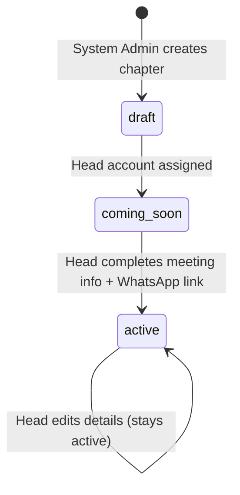

# UrCampusFellowship — User Stories & Core Workflows

This document translates the Requirements and System Design documents into buildable units: user stories grouped by epic, and the step-by-step workflows behind each core feature. Use this as the working reference while building — each story maps to a specific screen already covered in the wireframes and the v0 prompt.

---

## User Stories

Format: `As a [role], I want to [action], so that [benefit].` Each story includes acceptance criteria.

### Epic 1 — Student Authentication

**US-1.1** As a student, I want to sign up with just my email address, so that I don't need to remember a password.
- Acceptance: entering a valid email triggers an OTP sent via Google SMTP; invalid/malformed emails are rejected client-side before submission.

**US-1.2** As a student, I want to verify my email with a one-time code, so that my account is confirmed as mine.
- Acceptance: correct OTP logs the student in and issues a long-lived session; incorrect OTP shows an inline error without leaving the page; expired OTP offers a resend option.

**US-1.3** As a returning student, I want to stay logged in across visits, so that I don't have to re-verify every time.
- Acceptance: session persists 60–90 days by default; only expires or prompts re-verification on a new device or after expiry.

### Epic 2 — Campus & Directory Browsing

**US-2.1** As a student, I want to select my campus, so that I only see fellowships relevant to me.
- Acceptance: campus choice (Main Campus / Essikado) is asked once after first login and filters all subsequent directory views.

**US-2.2** As a student, I want to change my campus later, so that I'm not stuck if I move between campuses.
- Acceptance: campus is editable from Settings/Profile and immediately refreshes the directory.

**US-2.3** As a student, I want to browse and search fellowships alphabetically, so that I can quickly find the one I'm looking for.
- Acceptance: directory lists chapters for the selected campus only; search filters by name in real time.

**US-2.4** As a student, I want to see which fellowships are still being set up, so that I don't waste time trying to join something that isn't ready.
- Acceptance: chapters with `status = coming_soon` show a clearly labeled placeholder card with no meeting details and no "Register" action, only an optional "Notify me."

### Epic 3 — Registration & WhatsApp Join

**US-3.1** As a student, I want to see a fellowship's full details before joining, so that I know what I'm signing up for.
- Acceptance: an `active` chapter's profile page shows meeting day, time, location, and description.

**US-3.2** As a student, I want to register with my details, so that the fellowship's leader knows who I am.
- Acceptance: form collects Name, Phone Number, Campus, Program, Hostel/Hall, Level; all fields required before submit is enabled.

**US-3.3** As a student, I want to be blocked from joining a second fellowship while I'm already in one, so that membership stays honest.
- Acceptance: on submit, the system checks the student's email against existing `current_chapter_id` assignments; if one exists, registration is blocked and the error names the chapter they already belong to.

**US-3.4** As a student, I want instant access to the WhatsApp group after registering, so that I'm not left waiting for approval.
- Acceptance: successful registration immediately returns the chapter's stored WhatsApp invite link on a success screen — no pending/approval state exists in this flow.

### Epic 4 — Student Profile & Self-Service

**US-4.1** As a student, I want to view and edit my own profile, so that my details stay accurate.
- Acceptance: student can update Name, Program, Hall, Level, Phone Number; email is not editable (it's the identity key).

**US-4.2** As a student, I want to leave my current fellowship myself, so that I'm not stuck waiting on a chapter head to free me up.
- Acceptance: "Leave chapter" clears `current_chapter_id`, immediately allowing registration elsewhere; does not require chapter head approval.

### Epic 5 — Chapter Head Onboarding & Chapter Management

**US-5.1** As a chapter head, I want to log in with email and password, so that my account is protected more strongly than a student's.
- Acceptance: standard email/password auth via Supabase Auth; account was created by the System Admin, not self-registered.

**US-5.2** As a chapter head, I want to fill in my chapter's meeting details and WhatsApp link, so that my chapter becomes visible and joinable to students.
- Acceptance: saving meeting day, time, location, and a WhatsApp link flips `status` from `draft`/`coming_soon` to `active`; missing any required field keeps it non-active.

**US-5.3** As a chapter head, I want to edit my chapter's details later, so that I can update meeting logistics as they change.
- Acceptance: edits save immediately and reflect on the student-facing chapter profile without needing re-activation.

### Epic 6 — Member Roster Management

**US-6.1** As a chapter head, I want to see only my own chapter's members, so that I never see another chapter's data.
- Acceptance: roster query is scoped server-side (RLS) by the head's `chapter_id`; no UI path exposes another chapter's roster.

**US-6.2** As a chapter head, I want to flag or remove a member, so that I can keep my roster accurate and moderate after the fact (since joining is instant, not pre-approved).
- Acceptance: removing a member clears their `current_chapter_id`, freeing their email to register elsewhere; flagging leaves them on the roster with a visible flag state for follow-up.

### Epic 7 — System Admin: Denomination & Chapter Setup

**US-7.1** As the System Admin, I want to create a new denomination, so that its chapters have a parent entity to belong to.
- Acceptance: creating a denomination requires only name and optional description; no chapters exist yet.

**US-7.2** As the System Admin, I want to create a chapter shell for a specific campus, so that a fellowship leader has something to activate.
- Acceptance: chapter starts in `draft` status, tied to one denomination and one campus.

**US-7.3** As the System Admin, I want to assign a chapter head's account to a chapter, so that they can log in and complete setup.
- Acceptance: creating a head account (email + invite-based password setup) attaches it to exactly one chapter; one head per chapter.

### Epic 8 — System Admin: Platform Oversight

**US-8.1** As the System Admin, I want a structural overview of all denominations and chapters, so that I can manage the platform without seeing individual student data.
- Acceptance: dashboard shows chapter counts, statuses, and campuses; no student roster or contact data is visible from this role by default.

### Epic 9 — Shared: Password Recovery

**US-9.1** As a chapter head or admin, I want to reset a forgotten password, so that I'm not permanently locked out.
- Acceptance: email-based reset link flow; students are unaffected since they don't use passwords.

---

## Core Workflows

### 1. Student sign-up & verification

```
Enter email
   -> send OTP (Google SMTP)
   -> enter OTP
        -> correct?  -> yes -> issue long-lived session -> proceed to campus selection (first login only)
                     -> no  -> inline error, allow retry / resend
```

### 2. Registration with exclusivity check

```
Student opens a chapter profile (must be status = active)
   -> taps "Register to Join"
   -> fills form (Name, Phone Number, Campus, Program, Hall, Level)
   -> submit
        -> check: does this email already have a current_chapter_id?
             -> yes -> block, show error naming the existing chapter
             -> no  -> create registration, set current_chapter_id
                    -> return chapter's whatsapp_link
                    -> show success screen with "Open WhatsApp" CTA
```

### 3. Chapter lifecycle



Visibility by state:
- `draft` — not shown to students at all
- `coming_soon` — shown as a placeholder card (name, campus, "coming soon" label, optional "Notify me")
- `active` — fully visible, searchable, and joinable

### 4. Chapter head onboarding (admin side)

```
System Admin creates Denomination
   -> creates Chapter (draft, tied to a campus)
   -> creates Head account, attaches to that Chapter
        -> Head receives credentials / invite
        -> Head logs in
        -> Head completes chapter profile
             -> Chapter status -> active
```

### 5. Member moderation (post-join, since there's no pre-approval gate)

```
Head views roster (scoped to their chapter only)
   -> selects a member
        -> Flag -> stays on roster, marked for follow-up
        -> Remove -> current_chapter_id cleared -> student free to register elsewhere
```
Note: removing a member from the roster does **not** remove them from the WhatsApp group automatically — the Head still does that manually in WhatsApp itself, since the platform has no WhatsApp API integration.

### 6. Password reset (Heads & Admin only)

```
Request reset (enter email)
   -> reset link emailed
   -> click link -> set new password -> confirm -> done
```

---

## How to use this alongside the other project documents

- **Requirements Document** — the "why" behind every story here; check it if a story's intent is unclear.
- **System Design Document** — the schema and RLS policies these workflows assume; build against that schema directly.
- **Implementation Guide** (companion doc) — turns these workflows into an actual build order, routes, and environment setup.