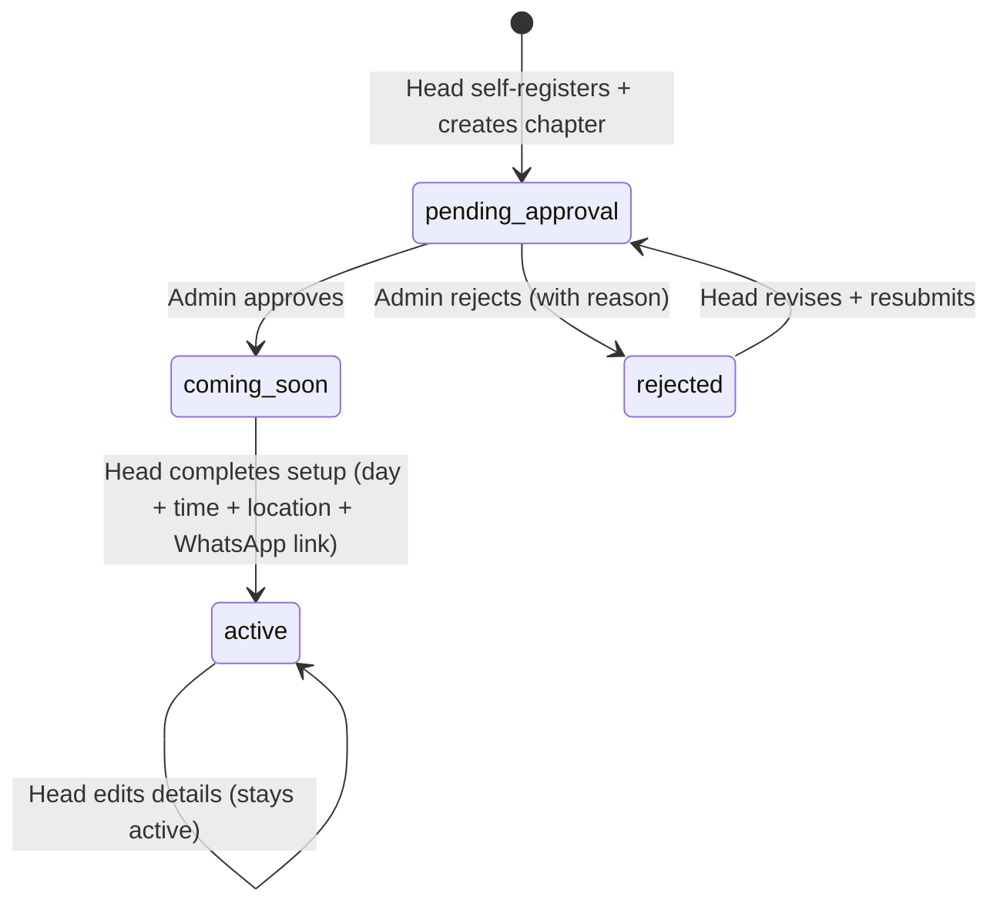

# UrCampusFellowship — Backend Infrastructure Plan

> **Status: v2 — Updated after design review (2026-09-25).** The head onboarding model has changed: heads now **self-register and create their own chapter**; the admin *approves* rather than creates. All other architectural decisions remain the same.

---

## 1. Executive Summary

The frontend is feature-complete and working against static mock data. The backend task is to replace every mock with **real, persisted, role-enforced data** without introducing unnecessary infrastructure complexity.

**Our chosen stack:**
- **Supabase** — PostgreSQL database, Auth, Row-Level Security, Realtime, Storage, Edge Functions
- **Next.js API Routes** (`/app/api/**`) — thin orchestration layer for business logic the client shouldn't touch
- **Google SMTP via Supabase Auth** — OTP delivery for student sign-in
- **Vercel** — hosting (already decided)

This approach means **no separate backend server**, **no separate auth service**, **no separate caching layer** needed at this scale. Supabase handles all of it with managed infrastructure.

---

## 2. Why Supabase + Next.js API Routes?

### Why not a standalone Express/NestJS server?
The system has ~12 distinct user-facing actions. A standalone server would introduce:
- A separate deployment, health checks, environment, and cost
- A separate auth system to build and maintain
- A separate RLS/permission model to implement in code rather than in the database

For an administrative directory system with no heavy compute, streaming, or background jobs — that overhead is unjustified.

### Why Supabase specifically?
| Need | How Supabase provides it |
|---|---|
| PostgreSQL relational data | First-class, fully managed |
| OTP email auth for students | Built-in via Auth + SMTP config |
| Email/password auth for heads | Built-in via Auth |
| Row-Level Security per role | Native PostgreSQL RLS — enforced at DB layer, impossible to bypass via API bugs |
| Chapter → Member scoping | RLS policy on `memberships` table by `chapter_id` |
| Real-time roster updates | Supabase Realtime subscriptions (optional but free) |
| File/image storage (e.g., logos) | Supabase Storage |
| Head self-registration + chapter creation | Standard Supabase `signUp` + our API route for post-signup chapter record creation |
| Admin approval workflow | Simple status column update guarded by RLS + admin middleware |

### Why keep Next.js API Routes at all?
Supabase can be called directly from the browser using the `@supabase/supabase-js` client with the **anon key**. However, certain operations **must not be triggered by the client directly** — they require the **service role key** (bypasses RLS) or enforce non-database business logic:

1. **Exclusivity check + registration** (atomic: check membership, then insert — must be a single transaction)
2. **Head signup with chapter creation** (two writes in sequence: create auth user, then create chapter record linked to that user ID — must be coordinated server-side)
3. **Admin approve/reject chapter** (status transition with email notification — service key needed)
4. **Chapter active transition** (validate full setup data before flipping `status → active`)
5. **OTP resend throttling** (prevent abuse without full rate-limit infrastructure)

Everything else (read queries scoped by RLS, profile updates) can be called from the browser directly using the anon key.

---

## 3. Database Schema

### 3.1 Tables

```sql
-- Campuses (seeded, not dynamic yet)
CREATE TABLE campuses (
  id   uuid PRIMARY KEY DEFAULT gen_random_uuid(),
  name text NOT NULL UNIQUE  -- e.g. "Main Campus", "Essikado"
);

-- Denominations (admin-managed)
CREATE TABLE denominations (
  id          uuid PRIMARY KEY DEFAULT gen_random_uuid(),
  name        text NOT NULL UNIQUE,
  description text,
  created_at  timestamptz DEFAULT now()
);

-- Chapters (the core entity)
-- STATUS LIFECYCLE (v2 — head self-service model):
--   pending_approval → draft (admin rejects, head revises) OR
--   pending_approval → coming_soon (admin approves, head setup incomplete) OR
--   coming_soon → active (head completes setup: meeting details + WhatsApp link)
--   rejected: terminal unless admin reopens
CREATE TABLE chapters (
  id                uuid PRIMARY KEY DEFAULT gen_random_uuid(),
  denomination_id   uuid REFERENCES denominations(id) ON DELETE RESTRICT,
  campus_id         uuid REFERENCES campuses(id) ON DELETE RESTRICT,
  name              text NOT NULL,
  status            text NOT NULL DEFAULT 'pending_approval'
                      CHECK (status IN (
                        'pending_approval', -- head signed up; waiting for admin review
                        'coming_soon',      -- admin approved; head hasn't completed setup
                        'active',           -- head completed setup; visible + joinable
                        'rejected',         -- admin rejected; head must revise + resubmit
                        'draft'             -- reserved for admin-created shells (rare edge case)
                      )),
  meeting_day       text,
  meeting_time      text,
  location          text,
  description       text,
  whatsapp_link     text,
  head_user_id      uuid REFERENCES auth.users(id) ON DELETE SET NULL,
  rejection_reason  text,   -- admin fills this on reject so head knows what to fix
  submitted_at      timestamptz DEFAULT now(),   -- when head submitted for approval
  approved_at       timestamptz,
  created_at        timestamptz DEFAULT now(),
  updated_at        timestamptz DEFAULT now()
);

-- Students (extends Supabase auth.users)
CREATE TABLE student_profiles (
  id                  uuid PRIMARY KEY REFERENCES auth.users(id) ON DELETE CASCADE,
  full_name           text,
  phone               text,
  program             text,
  hall                text,
  level               text CHECK (level IN ('100','200','300','400','postgrad')),
  campus_id           uuid REFERENCES campuses(id),
  current_chapter_id  uuid REFERENCES chapters(id) ON DELETE SET NULL,
  created_at          timestamptz DEFAULT now(),
  updated_at          timestamptz DEFAULT now()
);

-- Memberships (join log — historical, not replaced by current_chapter_id)
CREATE TABLE memberships (
  id          uuid PRIMARY KEY DEFAULT gen_random_uuid(),
  student_id  uuid REFERENCES student_profiles(id) ON DELETE CASCADE,
  chapter_id  uuid REFERENCES chapters(id) ON DELETE CASCADE,
  status      text NOT NULL DEFAULT 'active'
                CHECK (status IN ('active', 'flagged', 'removed')),
  joined_at   timestamptz DEFAULT now(),
  left_at     timestamptz,
  flagged_at  timestamptz,
  flagged_by  uuid REFERENCES auth.users(id)
);

-- Waitlist (for "Notify me" on coming_soon chapters)
CREATE TABLE chapter_waitlist (
  id          uuid PRIMARY KEY DEFAULT gen_random_uuid(),
  chapter_id  uuid REFERENCES chapters(id) ON DELETE CASCADE,
  email       text NOT NULL,
  created_at  timestamptz DEFAULT now(),
  UNIQUE (chapter_id, email)
);

-- User roles (used to distinguish student / head / admin without custom JWT claims initially)
CREATE TABLE user_roles (
  user_id  uuid PRIMARY KEY REFERENCES auth.users(id) ON DELETE CASCADE,
  role     text NOT NULL CHECK (role IN ('student', 'head', 'admin'))
);
```

> **Why a separate `memberships` table alongside `current_chapter_id` on `student_profiles`?**
> `current_chapter_id` is a fast lookup for the exclusivity check ("are you already in a chapter?"). The `memberships` table is the full audit trail — when a head removes a student, the membership record captures `left_at`, preserving history. Both are needed.

---

### 3.2 Row-Level Security (RLS) Policies

RLS is the **security backbone**. It is enforced by PostgreSQL — even if a bug in an API route makes the wrong query, the database refuses to return data the caller isn't allowed to see.

```sql
-- Enable RLS on all tables
ALTER TABLE chapters          ENABLE ROW LEVEL SECURITY;
ALTER TABLE student_profiles  ENABLE ROW LEVEL SECURITY;
ALTER TABLE memberships       ENABLE ROW LEVEL SECURITY;
ALTER TABLE chapter_waitlist  ENABLE ROW LEVEL SECURITY;
ALTER TABLE user_roles        ENABLE ROW LEVEL SECURITY;

-- ============================================================
-- CHAPTERS
-- ============================================================

-- Anyone (anon) can read active + coming_soon chapters
CREATE POLICY "chapters_public_read" ON chapters
  FOR SELECT TO anon, authenticated
  USING (status IN ('active', 'coming_soon'));

-- A head can read their own chapter at any status (so they see pending/rejected state)
CREATE POLICY "chapters_head_own_read" ON chapters
  FOR SELECT TO authenticated
  USING (head_user_id = auth.uid());

-- A head can INSERT a new chapter ONLY if they are attaching themselves as head
-- (enforced by the API route — chapter is inserted with their user ID)
CREATE POLICY "chapters_head_own_insert" ON chapters
  FOR INSERT TO authenticated
  WITH CHECK (head_user_id = auth.uid());

-- A head can UPDATE their own chapter ONLY if it is NOT yet approved
-- (once approved, admin controls status; head can only update meeting details)
CREATE POLICY "chapters_head_own_update" ON chapters
  FOR UPDATE TO authenticated
  USING (head_user_id = auth.uid())
  WITH CHECK (
    -- Heads can never self-promote status to 'coming_soon' or 'active'
    -- Status changes are admin-only; heads can only update detail fields
    -- This is enforced at API route level; RLS is a defence-in-depth backstop
    head_user_id = auth.uid()
  );

-- Admin can do everything (via service role key in API routes — bypasses RLS entirely)

-- ============================================================
-- STUDENT PROFILES
-- ============================================================

-- Students can read and update only their own profile
CREATE POLICY "student_profiles_own_rw" ON student_profiles
  FOR ALL TO authenticated
  USING (id = auth.uid())
  WITH CHECK (id = auth.uid());

-- ============================================================
-- MEMBERSHIPS
-- ============================================================

-- Students can only see their own memberships
CREATE POLICY "memberships_student_own" ON memberships
  FOR SELECT TO authenticated
  USING (student_id = auth.uid());

-- Chapter heads can see memberships for their chapter
CREATE POLICY "memberships_head_chapter" ON memberships
  FOR SELECT TO authenticated
  USING (
    chapter_id IN (
      SELECT id FROM chapters WHERE head_user_id = auth.uid()
    )
  );

-- Heads can update memberships for their chapter (flag / remove)
CREATE POLICY "memberships_head_update" ON memberships
  FOR UPDATE TO authenticated
  USING (
    chapter_id IN (
      SELECT id FROM chapters WHERE head_user_id = auth.uid()
    )
  );
```

> **Why not use Supabase's `custom access token hook` for role-based JWT claims yet?**
> For this scale, a `user_roles` table lookup on every RLS evaluation is simpler to implement and debug. JWT custom claims can be added in a later phase if performance requires it. The `user_roles` table is read-only for unprivileged users.

---

## 4. Authentication Strategy

Three distinct user types, three distinct auth flows.

### 4.1 Students — Email OTP (Magic Link / OTP)

```
POST /auth/v1/otp   ← Supabase built-in endpoint
  { email: "student@ucc.edu.gh", options: { shouldCreateUser: true } }

→ Supabase emails a 6-digit OTP via configured SMTP (Google SMTP)

POST /auth/v1/verify
  { type: "email", email, token: "123456" }

→ Returns session + user
→ Our Next.js middleware creates `student_profiles` row if first login
→ Session cookie set (HttpOnly, Secure, SameSite=Lax)
```

**Session duration**: 60–90 days (configured in Supabase dashboard under Auth → Settings).

**Why OTP and not magic link?**
OTP is a 6-digit code the user types. A magic link is a URL they click. OTP is better for mobile-first flows (no need to switch apps), which matches the student demographic. Supabase supports both with the same endpoint — just a config switch.

### 4.2 Chapter Heads — Self-Registration (Email + Password)

**New flow (v2):** Heads now self-register. There is no admin invite step.

```
Step 1 — Head visits /auth/signup and fills:
  Name, Email, Password
  + Denomination (dropdown — fetched from DB, admin-managed)
  + Chapter name (free text — e.g. "Catholic Students Union")
  + Campus (Main Campus / Essikado)

POST /api/auth/head/signup
  { name, email, password, denominationId, chapterName, campusId }

  Server does:
    1. supabase.auth.admin.createUser({ email, password })  ← service key
    2. user_roles.insert({ user_id, role: 'head' })
    3. chapters.insert({
         head_user_id: user.id,
         denomination_id: denominationId,
         campus_id: campusId,
         name: chapterName,
         status: 'pending_approval'  ← waits for admin
       })
    4. Return session to client

Step 2 — Head logs in normally:
POST /auth/v1/token?grant_type=password
  { email, password }
→ Returns session
→ Middleware checks user_roles → role = 'head' before granting /heads/** access

Step 3 — Head sees a "Pending approval" banner in /heads dashboard
  until admin approves.
  After approval, head sees normal setup prompt and completes chapter details.
```

**Why are Heads no longer invite-only?** 
The old model required the admin to: create a denomination → create a chapter shell → invite a head by email → wait for them to accept. That's 4 admin actions per fellowship. The new model requires the admin to: create a denomination (once) → click Approve on a head's signup request. That's 2 actions, and one of them scales automatically as heads sign themselves up.

### 4.3 System Admin — Email + Password

Same auth flow as heads, but `user_roles.role = 'admin'`. The admin account is seeded in the database directly — there is one admin account. No self-registration.

### 4.4 Route Protection (Next.js Middleware)

```typescript
// src/middleware.ts
export async function middleware(request: NextRequest) {
  const supabase = createServerClient(...)

  const { data: { session } } = await supabase.auth.getSession()

  const path = request.nextUrl.pathname

  // Unauthenticated → redirect to login
  if (!session && (path.startsWith('/heads') || path.startsWith('/admin'))) {
    return NextResponse.redirect(new URL('/auth/login', request.url))
  }

  // Role check: head trying to access /admin → redirect
  if (session && path.startsWith('/admin')) {
    const role = await getUserRole(session.user.id)
    if (role !== 'admin') return NextResponse.redirect(new URL('/heads', request.url))
  }

  return NextResponse.next()
}
```

---

## 5. API Routes

All routes live under `src/app/api/`. They use the **Supabase service role key** for operations that bypass RLS (admin actions) and the **user's session token** for user-scoped operations (validated via `createServerClient`).

### 5.1 Student Routes

| Method | Path | What it does | Why it's an API route (not direct DB call) |
|---|---|---|---|
| `POST` | `/api/student/register` | Exclusivity check + create membership atomically | Must be a DB transaction; client can't safely do atomic check-then-insert |
| `POST` | `/api/student/leave` | Clear `current_chapter_id`, mark membership `removed` | Must update two tables atomically |
| `PATCH` | `/api/student/profile` | Update student profile fields | Direct Supabase call with anon key + RLS is fine here — this CAN be a client call |
| `POST` | `/api/student/waitlist` | Add email to `chapter_waitlist` | Simple insert; could be a client call, but rate limiting is easier in a route |

**`/api/student/register` — The critical path:**

```typescript
// src/app/api/student/register/route.ts
export async function POST(request: Request) {
  const supabase = createServiceClient() // service role key — we own this transaction
  const session = await getSessionFromRequest(request)

  if (!session) return Response.json({ error: 'Unauthorized' }, { status: 401 })

  const { chapterId, name, phone, program, hall, level, campus } = await request.json()

  // Step 1: Check exclusivity — does this student already have a chapter?
  const { data: profile } = await supabase
    .from('student_profiles')
    .select('current_chapter_id, chapters(name)')
    .eq('id', session.user.id)
    .single()

  if (profile?.current_chapter_id) {
    return Response.json({
      error: `You're already registered with ${profile.chapters?.name}. Leave that chapter first.`
    }, { status: 409 })
  }

  // Step 2: Verify chapter is active
  const { data: chapter } = await supabase
    .from('chapters')
    .select('id, status, whatsapp_link')
    .eq('id', chapterId)
    .single()

  if (!chapter || chapter.status !== 'active') {
    return Response.json({ error: 'Chapter is not available for registration.' }, { status: 400 })
  }

  // Step 3: Upsert student profile + create membership (two writes, both must succeed)
  const { error: profileError } = await supabase
    .from('student_profiles')
    .upsert({
      id: session.user.id,
      full_name: name,
      phone,
      program,
      hall,
      level,
      current_chapter_id: chapterId,
    })

  if (profileError) return Response.json({ error: 'Registration failed.' }, { status: 500 })

  await supabase.from('memberships').insert({
    student_id: session.user.id,
    chapter_id: chapterId,
    status: 'active',
  })

  // Step 4: Return WhatsApp link
  return Response.json({ whatsapp_link: chapter.whatsapp_link })
}
```

> **Note on atomicity**: Supabase JS v2 doesn't expose `BEGIN/COMMIT` directly from the client. For true atomicity, this logic can be wrapped in a **Supabase Database Function** (PL/pgSQL stored procedure) called via `supabase.rpc('register_student', {...})`. This is the safest approach and should be used in production.

---

### 5.2 Chapter Head Routes

| Method | Path | What it does |
|---|---|---|
| `GET` | `/api/heads/chapter` | Get own chapter (works at any status — head sees pending/rejected too) |
| `PATCH` | `/api/heads/chapter` | Update chapter meeting details; auto-transitions to `active` when complete |
| `POST` | `/api/heads/chapter/resubmit` | Re-submit a `rejected` chapter for admin review (resets to `pending_approval`) |
| `GET` | `/api/heads/roster` | Get all `active` members for own chapter |
| `PATCH` | `/api/heads/members/[memberId]` | Flag or remove a member |

**`/api/heads/chapter` PATCH — Status auto-transition logic (unchanged):**

```typescript
// Head can only call this after admin approval (status = 'coming_soon' or 'active')
// Guard: reject PATCH if chapter status is 'pending_approval' or 'rejected'
if (['pending_approval', 'rejected'].includes(chapter.status)) {
  return Response.json(
    { error: 'Chapter is not yet approved. You cannot edit details until approval.' },
    { status: 403 }
  )
}

// Auto-activate when all required fields are present
const requiredForActive = ['meeting_day', 'meeting_time', 'location', 'whatsapp_link']
const isComplete = requiredForActive.every(field => updatedData[field]?.trim())
const newStatus = isComplete ? 'active' : 'coming_soon' // never go backward
```

**`/api/heads/chapter/resubmit` — Re-submit after rejection:**

```typescript
export async function POST(request: Request) {
  const session = await getSessionFromRequest(request)
  if (!session) return Response.json({ error: 'Unauthorized' }, { status: 401 })

  const supabase = createServiceClient()

  // Fetch head's chapter
  const { data: chapter } = await supabase
    .from('chapters')
    .select('id, status')
    .eq('head_user_id', session.user.id)
    .single()

  if (!chapter || chapter.status !== 'rejected') {
    return Response.json({ error: 'Only rejected chapters can be resubmitted.' }, { status: 400 })
  }

  // Reset to pending_approval, clear rejection reason
  await supabase
    .from('chapters')
    .update({ status: 'pending_approval', rejection_reason: null })
    .eq('id', chapter.id)

  return Response.json({ success: true })
}
```

---

### 5.3 Admin Routes

All admin routes use the **service role key**. They are protected by middleware verifying `user_roles.role = 'admin'`.

**Admin's role (v2):** Admins no longer create chapter shells or invite heads. Their chapter management role is now:
- **Create and manage denominations** (unchanged)
- **Review pending chapter applications** and approve or reject them
- **Monitor all chapters** across statuses

| Method | Path | What it does |
|---|---|---|
| `GET` | `/api/admin/stats` | Platform overview: chapter counts by status/campus, denomination count, pending approvals count |
| `POST` | `/api/admin/denominations` | Create new denomination |
| `PATCH` | `/api/admin/denominations/[id]` | Edit denomination name/description |
| `GET` | `/api/admin/denominations` | List all denominations with chapter counts |
| `GET` | `/api/admin/chapters` | List all chapters (all statuses) with head info |
| `PATCH` | `/api/admin/chapters/[id]` | General chapter edits (admin corrections to name, denomination, etc.) |
| `POST` | `/api/admin/chapters/[id]/approve` | Approve a `pending_approval` chapter → sets status to `coming_soon` |
| `POST` | `/api/admin/chapters/[id]/reject` | Reject a chapter → sets status to `rejected` + stores rejection reason |
| `GET` | `/api/admin/chapters/pending` | List only chapters with `status = pending_approval` (admin review queue) |

**`/api/admin/chapters/[id]/approve` — Approve flow:**

```typescript
export async function POST(request: Request, { params }: { params: { id: string } }) {
  // Middleware has already verified admin role
  const supabase = createServiceClient()

  const { data: chapter } = await supabase
    .from('chapters')
    .select('id, status, head_user_id')
    .eq('id', params.id)
    .single()

  if (!chapter || chapter.status !== 'pending_approval') {
    return Response.json({ error: 'Chapter is not in pending_approval state.' }, { status: 400 })
  }

  // Approve: set status to coming_soon, record approved_at
  await supabase
    .from('chapters')
    .update({ status: 'coming_soon', approved_at: new Date().toISOString() })
    .eq('id', params.id)

  // Optional: send approval email to head via Supabase Edge Function or direct SMTP
  // await notifyHeadOfApproval(chapter.head_user_id)

  return Response.json({ success: true })
}
```

**`/api/admin/chapters/[id]/reject` — Reject flow:**

```typescript
export async function POST(request: Request, { params }: { params: { id: string } }) {
  const { reason } = await request.json() // Admin provides a short reason
  const supabase = createServiceClient()

  await supabase
    .from('chapters')
    .update({ status: 'rejected', rejection_reason: reason })
    .eq('id', params.id)

  // Optional: email the head with the rejection reason
  // await notifyHeadOfRejection(chapter.head_user_id, reason)

  return Response.json({ success: true })
}
```

---

### 5.4 Auth Routes

These are wrappers around Supabase Auth that add our post-login side effects.

| Method | Path | What it does |
|---|---|---|
| `POST` | `/api/auth/otp/send` | Student OTP: calls Supabase `signInWithOtp`; throttle-safe |
| `POST` | `/api/auth/otp/verify` | Student OTP verify: creates `student_profiles` + `user_roles` row on first login |
| `POST` | `/api/auth/login` | Email/password login for heads + admin |
| `POST` | `/api/auth/logout` | Clears session |
| `POST` | `/api/auth/reset-password` | Triggers Supabase password reset email |
| **`POST`** | **`/api/auth/head/signup`** | **Head self-registration: creates auth user + chapter + role in one atomic server call** |

**`/api/auth/head/signup` — The new head onboarding endpoint:**

```typescript
export async function POST(request: Request) {
  const { name, email, password, denominationId, chapterName, campusId } =
    await request.json()

  // Validate inputs with Zod before touching the DB
  const parsed = HeadSignupSchema.safeParse({ name, email, password, denominationId, chapterName, campusId })
  if (!parsed.success) {
    return Response.json({ error: parsed.error.flatten() }, { status: 422 })
  }

  const supabase = createServiceClient() // service key — we must coordinate user + chapter creation

  // Step 1: Check denomination exists (admin must have created it first)
  const { data: denomination } = await supabase
    .from('denominations')
    .select('id, name')
    .eq('id', denominationId)
    .single()

  if (!denomination) {
    return Response.json({ error: 'Denomination not found. Select a valid denomination.' }, { status: 400 })
  }

  // Step 2: Check no chapter with the same name exists in this denomination + campus
  const { data: duplicate } = await supabase
    .from('chapters')
    .select('id')
    .eq('denomination_id', denominationId)
    .eq('campus_id', campusId)
    .ilike('name', chapterName.trim())
    .maybeSingle()

  if (duplicate) {
    return Response.json(
      { error: 'A chapter with this name already exists in this denomination and campus.' },
      { status: 409 }
    )
  }

  // Step 3: Create the Supabase auth user
  const { data: { user }, error: authError } = await supabase.auth.admin.createUser({
    email,
    password,
    user_metadata: { full_name: name },
    email_confirm: true, // Skip email verification for heads (they're vetted by admin approval)
  })

  if (authError) {
    // Handle duplicate email gracefully
    if (authError.message.includes('already registered')) {
      return Response.json({ error: 'An account with this email already exists.' }, { status: 409 })
    }
    return Response.json({ error: 'Account creation failed.' }, { status: 500 })
  }

  // Step 4: Set role to 'head'
  await supabase.from('user_roles').insert({ user_id: user!.id, role: 'head' })

  // Step 5: Create chapter in pending_approval state
  await supabase.from('chapters').insert({
    head_user_id: user!.id,
    denomination_id: denominationId,
    campus_id: campusId,
    name: chapterName.trim(),
    status: 'pending_approval',
  })

  // Step 6: Sign in and return session (so the head lands on the dashboard immediately)
  const { data: sessionData } = await supabase.auth.signInWithPassword({ email, password })

  return Response.json({
    message: 'Account created. Your chapter application is pending admin approval.',
    session: sessionData.session,
  })
}
```

> **Why use `auth.admin.createUser` instead of `auth.signUp`?**
> `auth.signUp` is a browser-side call that would require the anonymous key and has weaker server-side control. Using the Admin SDK from our server route lets us atomically confirm the email (skipping a verification step for heads — they are vetted via the admin approval process instead) and immediately create the linked `chapters` and `user_roles` records before returning. If either DB write fails, we can roll back by deleting the auth user, giving us clean error handling.

---

## 6. Server Actions vs API Routes

Next.js 15+ Server Actions are a third option alongside client-side Supabase calls and API routes. Here's the decision for this system:

| Use case | Approach | Reason |
|---|---|---|
| Student registration (exclusivity check) | API Route | Needs explicit error responses with status codes; better for client-side error handling |
| Profile updates (student) | **Server Action** or direct Supabase | Simple, RLS-guarded write — Server Action is cleaner |
| Chapter setup by head | **Server Action** | Form submission with revalidation of the page cache is the ideal Next.js pattern here |
| Admin chapter creation | API Route | Admin dashboard calls need consistent status codes for UI feedback |
| Auth flows | API Route | Cookie management requires manual `Response` control |

**Recommendation**: Start with API routes everywhere for consistency and debuggability. Migrate profile/setup forms to Server Actions after the core system is working. This avoids mixing two patterns during initial build.

---

## 7. Email Configuration

Supabase handles OTP delivery and invite emails. In development it uses Supabase Inbucket (local email testing). In production:

1. **Supabase Dashboard → Auth → SMTP Settings**
   - SMTP Host: `smtp.gmail.com`
   - Port: `587`
   - User: the sender Gmail address
   - Password: Google App Password (not the Gmail password — 2FA must be on)
   - Sender name: `UrCampusFellowship`

2. **Supabase Dashboard → Auth → Email Templates** — Customize:
   - OTP email: `"Your UrCampusFellowship code is: {{ .Token }}"`
   - Invite email: `"You've been set up as a chapter head on UrCampusFellowship. Set your password..."`
   - Password reset email

> **No SendGrid / Resend / Postmark needed at this stage.** Google SMTP via Supabase is sufficient for a small university platform. If volume grows (thousands of OTPs per day), swap to Resend with a Supabase webhook — but that problem doesn't exist yet.

---

## 8. Environment Variables

```env
# .env.local (never commit this)

# Supabase
NEXT_PUBLIC_SUPABASE_URL=https://xxxx.supabase.co
NEXT_PUBLIC_SUPABASE_ANON_KEY=eyJh...   # safe for browser — READ ONLY + RLS
SUPABASE_SERVICE_ROLE_KEY=eyJh...        # NEVER expose to browser — bypasses RLS

# App
NEXT_PUBLIC_APP_URL=https://urcampusfellowship.vercel.app
```

The `NEXT_PUBLIC_*` variables are exposed to the browser bundle. The service role key is **server-only** — it is only used inside `src/app/api/**` routes and never imported in a file that reaches the client.

---

## 9. Supabase Client Setup

Two distinct clients — a pattern critical for security:

```typescript
// src/lib/supabase/client.ts — Browser client (anon key, RLS enforced)
import { createBrowserClient } from '@supabase/ssr'

export function createClient() {
  return createBrowserClient(
    process.env.NEXT_PUBLIC_SUPABASE_URL!,
    process.env.NEXT_PUBLIC_SUPABASE_ANON_KEY!
  )
}

// src/lib/supabase/server.ts — Server client (session-aware, for Server Components / API routes)
import { createServerClient } from '@supabase/ssr'
import { cookies } from 'next/headers'

export async function createServerSupabaseClient() {
  const cookieStore = await cookies()
  return createServerClient(
    process.env.NEXT_PUBLIC_SUPABASE_URL!,
    process.env.NEXT_PUBLIC_SUPABASE_ANON_KEY!,
    { cookies: { getAll: () => cookieStore.getAll(), setAll: (...) => ... } }
  )
}

// src/lib/supabase/service.ts — Service client (service role key, bypasses RLS — server only)
import { createClient } from '@supabase/supabase-js'

export function createServiceClient() {
  return createClient(
    process.env.NEXT_PUBLIC_SUPABASE_URL!,
    process.env.SUPABASE_SERVICE_ROLE_KEY!
  )
}
```

---

## 10. What We Are NOT Building (And Why)

| What | Why we're skipping it |
|---|---|
| Separate backend server (Express/NestJS) | No compute-heavy logic, no streaming. Next.js API routes are sufficient |
| Custom JWT auth system | Supabase Auth covers all three auth flows (OTP, email/password, invite) |
| Redis caching layer | No high-read-frequency public data that warrants caching yet. Directory data can be cached via Next.js `fetch()` ISR |
| Background job queue | No async jobs needed. WhatsApp link is returned synchronously |
| WebSockets / real-time push | Supabase Realtime is available for head roster updates if desired, but not a requirement for v1 |
| WhatsApp Business API | The platform stores a WhatsApp group invite _link_ and displays it — no API integration |
| SMS notifications | Out of scope — OTP is email-only |
| File uploads / image storage | No user-generated images in v1 (chapter logos could come in v2 via Supabase Storage) |

---

## 11. Updated Chapter Lifecycle (v2)



**Visibility by state:**
- `pending_approval` — not visible to students; head sees "Under review" banner in dashboard
- `rejected` — not visible to students; head sees rejection reason + "Resubmit" CTA
- `coming_soon` — visible as placeholder card (name, campus, "Coming soon" label, optional "Notify me")
- `active` — fully visible, searchable, and joinable

**What the admin sees in their chapter queue:**
- A dedicated "Pending approvals" section at the top of `/admin/chapter`
- For each pending chapter: chapter name, denomination, campus, head name + email, submission date
- Two actions: **Approve** (one click) or **Reject** (requires a short reason text)

---

## 12. Implementation Phases (v2)

```
Phase 1 — Foundation (Week 1)
├── Supabase project setup + environment variables
├── Database schema + RLS policies (SQL migrations) — including new chapter statuses
├── Three Supabase client wrappers (browser, server, service)
├── Next.js middleware for route protection
├── Seed: campuses table (Main Campus, Essikado)
└── Local dev: Supabase CLI + Docker for local DB

Phase 2 — Auth Flows (Week 1–2)
├── Student OTP send + verify → session + student_profiles creation
├── Head self-registration (POST /api/auth/head/signup)
│     └── creates auth user + chapter(pending_approval) + user_roles in one call
├── Head/Admin email+password login
├── Password reset flow
└── Logout endpoint

Phase 3 — Head Dashboard APIs (Week 2)
├── GET /api/heads/chapter — returns own chapter at any status
├── Head dashboard shows status-aware UI:
│     pending_approval → "Under review" banner
│     rejected → rejection reason + "Resubmit" button
│     coming_soon → chapter setup form (heads/setup)
│     active → normal dashboard
├── PATCH /api/heads/chapter — update details + auto-activate
└── POST /api/heads/chapter/resubmit — reset rejected → pending_approval

Phase 4 — Admin Dashboard APIs (Week 2–3)
├── GET /api/admin/chapters/pending — review queue
├── POST /api/admin/chapters/[id]/approve
├── POST /api/admin/chapters/[id]/reject
├── Denomination CRUD (POST + GET + PATCH /api/admin/denominations)
├── GET /api/admin/chapters — full chapter list
└── GET /api/admin/stats — platform overview

Phase 5 — Student Feature APIs (Week 3)
├── Fellowship directory (replace static chapters.ts)
├── Chapter detail page (live from DB)
├── Registration API (exclusivity check + atomic write / stored procedure)
├── Leave chapter API
└── Waitlist API

Phase 6 — Roster Management (Week 3)
├── GET /api/heads/roster
└── PATCH /api/heads/members/[memberId] (flag / remove)

Phase 7 — Polish & Hardening (Week 4)
├── OTP rate limiting
├── Zod validation on all API routes
├── Approval/rejection email notifications (Supabase Edge Function or direct SMTP)
├── Error boundary + toast feedback wiring in frontend
├── Supabase stored procedure for atomic student registration
└── End-to-end testing of all three role flows
```

---

## 12. Reliability Assessment

| Component | Reliability | Notes |
|---|---|---|
| Supabase PostgreSQL | ★★★★★ | Managed, daily backups, Point-in-time recovery on Pro plan |
| Supabase Auth | ★★★★★ | Battle-tested by thousands of apps; OTP + email/password both proven |
| Row-Level Security | ★★★★★ | Database-level enforcement — cannot be bypassed by application bugs |
| Next.js API Routes on Vercel | ★★★★☆ | Serverless — cold starts exist but are <300ms for this scale |
| Google SMTP via Supabase | ★★★☆☆ | Reliable for low volume; Gmail limits 500 emails/day. Upgrade to Resend if needed |
| Supabase Realtime (optional) | ★★★★☆ | WebSocket-based; works well for roster live updates |
| `inviteUserByEmail` onboarding | ★★★★☆ | Rock-solid Supabase Admin API; email deliverability depends on SMTP config |

**Overall system reliability for this use case: High.** The only variable is email deliverability for OTPs. That risk is mitigated by:
1. Using Google SMTP (high deliverability to .edu.gh addresses)
2. Offering a "resend OTP" UI path
3. Option to upgrade to Resend (a transactional email service) with zero schema changes — only the SMTP config in Supabase changes

---

## 13. Questions for Review (v2)

Before implementation begins, the team should confirm:

1. **Is one admin account sufficient?** The current design seeds one admin. If multiple admins are needed, `user_roles` already supports it — just a matter of who creates the additional admin accounts.

2. **Do we want "Leave chapter" to be instant?** Currently the design says yes (no head approval needed). Confirm it's still the intent.

3. **Should removed students receive an email notification?** Not in the current spec, but worth discussing. Supabase can trigger an email via a Database Webhook → Edge Function if desired.

4. **Campus list — is it hardcoded or dynamic?** Currently two campuses: Main Campus and Essikado. The schema has a `campuses` table so they can be seeded and extended. Confirm if campus management should be an admin UI feature or a seeded constant.

5. **What counts as "complete" for a chapter to go active?** Currently: `meeting_day + meeting_time + location + whatsapp_link`. Confirm this is the full gate.

6. **NEW — Should the admin receive a notification when a new chapter is submitted?** Without a notification, the admin has to manually check the pending queue. Options:
   - Email notification via SMTP when a new chapter hits `pending_approval` (simple, low-cost)
   - Real-time badge counter in the admin dashboard (requires a DB subscription or polling)
   - Both
   Recommend: Email notification + badge count on admin dashboard as a starting point.

7. **NEW — Can a head change their denomination or campus after submitting?** Once submitted for approval, changing these would effectively be a new application. Options:
   - Lock denomination + campus after first submission (require admin to manually correct if wrong)
   - Allow head to edit and auto-reset to `pending_approval` on any change
   Recommend: Lock them after submission to prevent abuse; head must contact admin for corrections.

8. **NEW — What happens if an admin rejects a chapter and the head never resubmits?** The chapter sits in `rejected` status. Options:
   - Auto-archive after X days of inactivity (soft delete)
   - Leave it in `rejected` indefinitely (admin can clean up manually)
   Recommend: Leave it for now; add a cleanup mechanism in a later phase.

9. **NEW — Should heads be email-verified before their chapter enters the approval queue?** Currently the plan skips email verification for heads (they're vetted by the admin approval process). If email verification is preferred, the chapter status would stay at a new `unverified` state until the head confirms their email — adding friction but improving data integrity.

---

*Document v1 prepared: 2026-09-25. Updated to v2: 2026-09-25 (head self-service model).*
